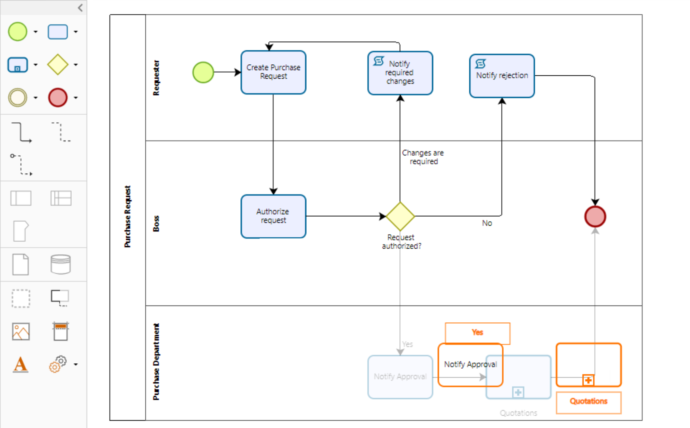

# CollabDiagrams

## Autor
### Oscar Nicolas Piñeros Campo

## Heroku

## Resumen

CollabDiagrams es una plataforma que permite a los estudiantes crear y editar diagramas de forma colaborativa, de manera que los diagramas de clases, actividades, entre otros, que usan en diversas materias (Programación Orientada a Objetos, Automatización de Procesos, Arquitectura de Software, etc...) las puedan manejar en un mismo sistema ya sea para uso personal o para proyectos con otros estudiantes. 

## Descripción

### Antecedentes (Bizagi)

Esta herramienta se usa en Automatización de Procesos y en parte para los diagramas de actividades de otras materias

Pero esta aplicacion no cuenta con la opcion de tener varios usuarios a la vez editando el diagrama, por lo que esto es lo que buscamos con CollabDiagrams

## Historias de Usuario

[Historias de Usuario](https://tree.taiga.io/project/nicolaspineros-collabdiagrams/backlog)
