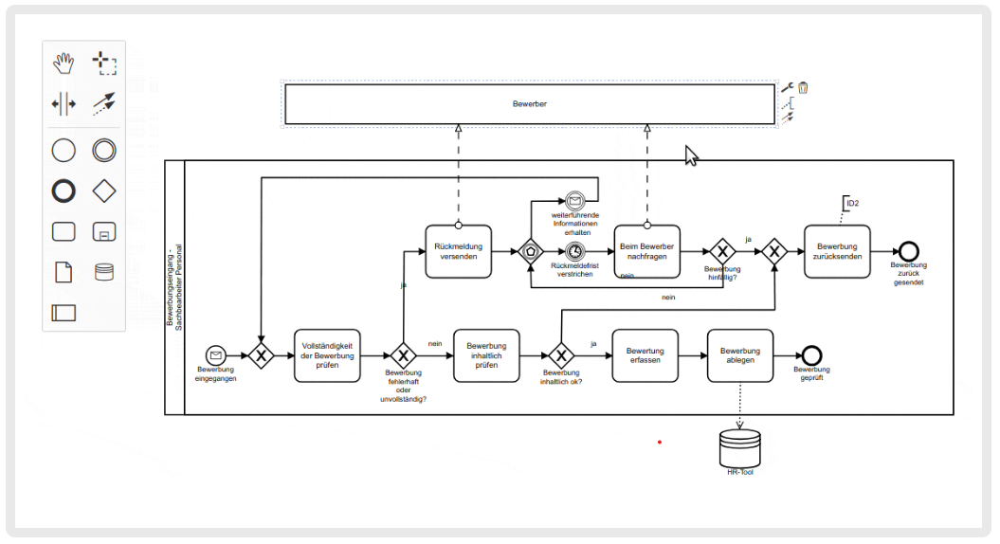

# CollabDiagrams

## Autor
### Nicolas Piñeros Campo

## Resumen

CollabDiagrams es una plataforma que permite a los estudiantes crear y editar diagramas de forma colaborativa, de manera que los diagramas de clases, actividades, entre otros, que usan en diversas materias (Programación Orientada a Objetos, Automatización de Procesos, Arquitectura de Software, etc...) las puedan manejar en un mismo sistema ya sea para uso personal o para proyectos con otros estudiantes. 

## Descripción

## Historias de Usuario

[Historias de Usuario](https://tree.taiga.io/project/nicolaspineros-collabdiagrams/backlog)
